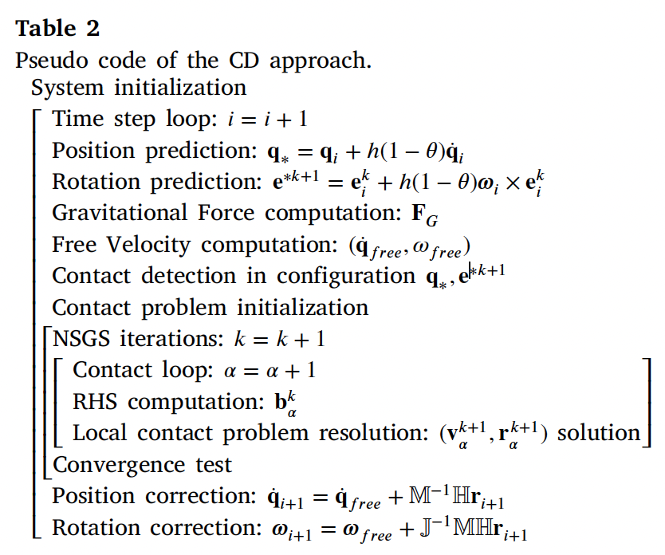
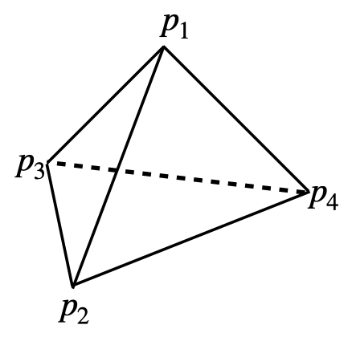
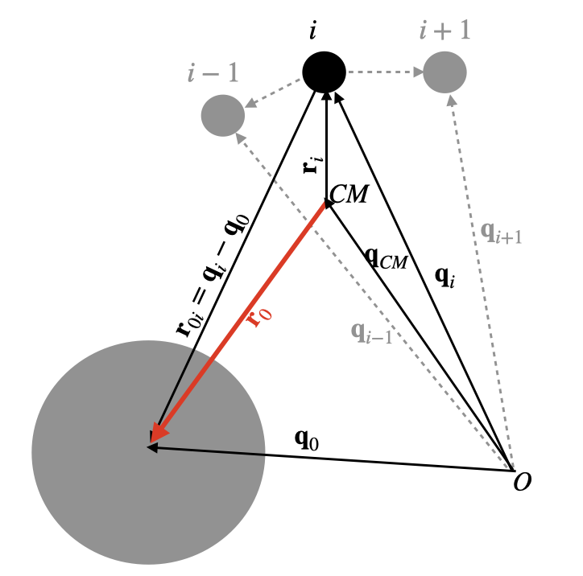
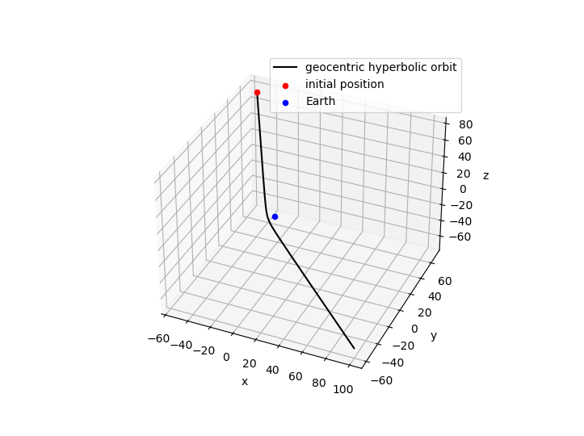
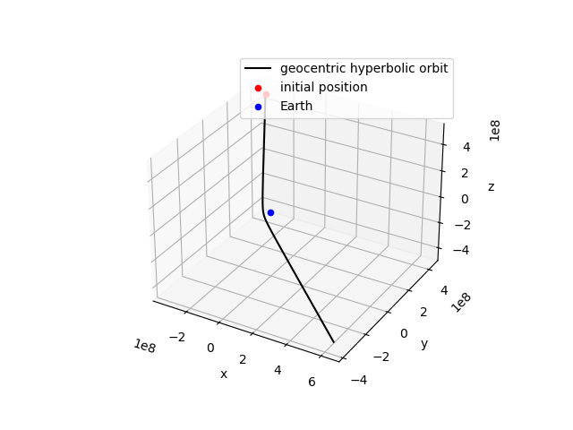
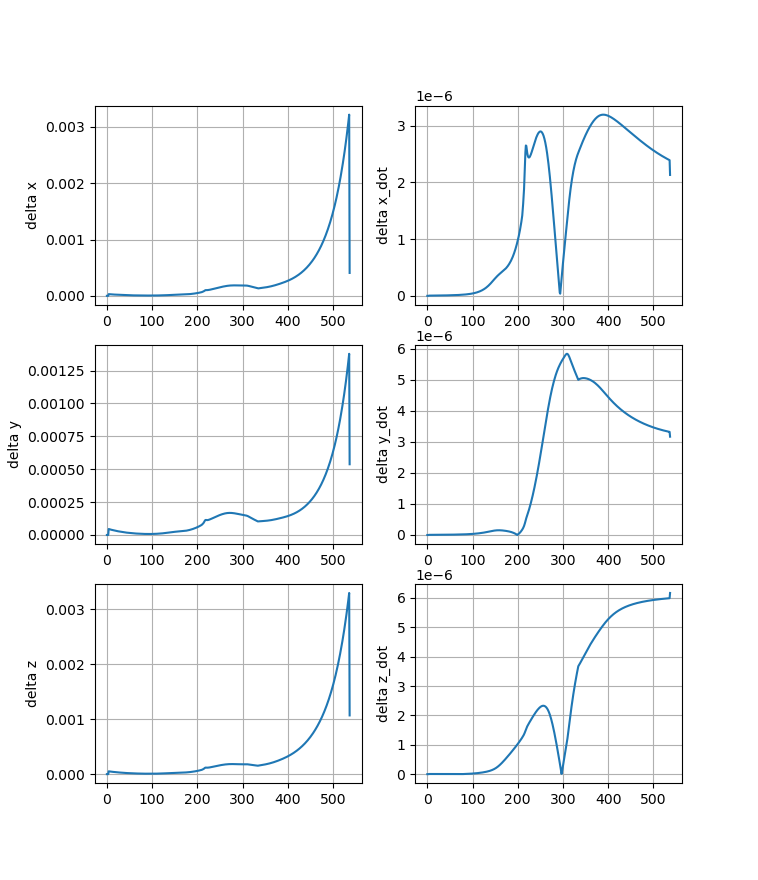

# I PolyhedronSimulation
This Project uses LMGC90 to simulate Polyhendron's behavior under gravitation. The LMGC90 is one of the discrete element methods which can handle detailed contact dynamics.

There are a few papers about the code and the method (by [F. Dubois](https://scholar.google.com/citations?user=boV9fugAAAAJ&hl=en&oi=ao) and others) that you can find for yourself.  However, this is a [paper](https://www.sciencedirect.com/science/article/pii/S0019103521001238) we wrote about the implementation of self-gravity.  The code also has a [wiki](https://git-xen.lmgc.univ-montp2.fr/lmgc90/lmgc90_user/-/wikis/home) page and a very comprehensive [documentation page](https://lmgc90.pages-git-xen.lmgc.univ-montp2.fr/lmgc90_dev/) that you will find very useful once you start using it.

The implementation of gravitational forces is of paramount importance when simulating granular asteroids. In this work the Open Source Python library written by Mike Grudić, called [pykdgrav](https://github.com/mikegrudic/pytreegrav), is used [(Guszejnov et al., 2019a)](https://academic.oup.com/mnras/article/492/1/488/5679905). This routine is not to be confused with the PKDgrav code which has been used for many years in the Planetary and Space Science community to carry out research on asteroids, comets and planetary rings. Grudić affirms however, having taken the idea of implementing a kd-tree instead of an octree from PKDgrav. 

## I-1. General Structure

- Preprocessor: Construct a numerical model
- Computation
- Visualize and analyze results

## I-2. wiki of pykdgrav
[pykdgrav](https://github.com/mikegrudic/pytreegrav/issues/1)

## I-3. tetrahedron volume formula

$$V=\frac{1}{6}\left|\begin{array}{lll}
x_2-x_1 & y_2-y_1 & z_2-z_1 \\
x_3-x_1 & y_3-y_1 & z_3-z_1 \\
x_4-x_1 & y_4-y_1 & z_4-z_1
\end{array}\right|$$

# II N-body Dynamics 

Starting from 3-body problem
$$
m_0 \ddot{\mathbf{q}}_0 = \frac{G (m_1+m_2) m_0\left(\mathbf{q}_{cm}-\mathbf{q}_0\right)}{\left\|\mathbf{q}_{cm}-\mathbf{q}_0\right\|^3}\\
(m_1+m_2) \ddot{\mathbf{q}}_{cm} = \frac{G (m_1+m_2) m_0\left(\mathbf{q}_0-\mathbf{q}_{cm}\right)}{\left\|\mathbf{q}_0-\mathbf{q}_{cm}\right\|^3}\\
m_1 \ddot{\mathbf{q}}_1 = \frac{G m_1m_2\left(\mathbf{q}_2-\mathbf{q}_1\right)}{\left\|\mathbf{q}_2-\mathbf{q}_1\right\|^3} + \frac{G m_1m_0\left(\mathbf{q}_0-\mathbf{q}_1\right)}{\left\|\mathbf{q}_0-\mathbf{q}_1\right\|^3}\\
m_2 \ddot{\mathbf{q}}_2 = \frac{G m_1m_2\left(\mathbf{q}_1-\mathbf{q}_2\right)}{\left\|\mathbf{q}_1-\mathbf{q}_2\right\|^3} + \frac{G m_2m_0\left(\mathbf{q}_0-\mathbf{q}_2\right)}{\left\|\mathbf{q}_0-\mathbf{q}_2\right\|^3}\\
$$
Removing the mass, we get
$$
\ddot{\mathbf{q}}_0 = \frac{G (m_1+m_2)\left(\mathbf{q}_{cm}-\mathbf{q}_0\right)}{\left\|\mathbf{q}_{cm}-\mathbf{q}_0\right\|^3}\\
\ddot{\mathbf{q}}_{cm} = \frac{G m_0\left(\mathbf{q}_0-\mathbf{q}_{cm}\right)}{\left\|\mathbf{q}_0-\mathbf{q}_{cm}\right\|^3}\\
\ddot{\mathbf{q}}_1 = \frac{G m_2\left(\mathbf{q}_2-\mathbf{q}_1\right)}{\left\|\mathbf{q}_2-\mathbf{q}_1\right\|^3} + \frac{G m_0\left(\mathbf{q}_0-\mathbf{q}_1\right)}{\left\|\mathbf{q}_0-\mathbf{q}_1\right\|^3}\\
\ddot{\mathbf{q}}_2 = \frac{G m_1\left(\mathbf{q}_1-\mathbf{q}_2\right)}{\left\|\mathbf{q}_1-\mathbf{q}_2\right\|^3} + \frac{Gm_0\left(\mathbf{q}_0-\mathbf{q}_2\right)}{\left\|\mathbf{q}_0-\mathbf{q}_2\right\|^3}\\
$$
Then bring the below relationship into these equations
$$
\mathbf{r}_i = \mathbf{q}_{i} - \mathbf{q}_{cm},~~ i=0,1,2
$$
we have
$$
\ddot{\mathbf{r}}_0 = -\frac{G (m_0+m_1+m_2)\mathbf{r}_0}{\left\|\mathbf{r}_0\right\|^3}\\
\ddot{\mathbf{r}}_1 = \frac{G m_2(\mathbf{r}_2 - \mathbf{r}_1)}{\left\|\mathbf{r}_2 - \mathbf{r}_1\right\|^3} + \frac{G m_0(\mathbf{r}_0 - \mathbf{r}_1)}{\left\|\mathbf{r}_0 - \mathbf{r}_1\right\|^3} -\frac{G m_0\mathbf{r}_0}{\left\|\mathbf{r}_0\right\|^3}\\
\ddot{\mathbf{r}}_2 = \frac{G m_1(\mathbf{r}_1 - \mathbf{r}_2)}{\left\|\mathbf{r}_1 - \mathbf{r}_2\right\|^3} + \frac{G m_0(\mathbf{r}_0 - \mathbf{r}_2)}{\left\|\mathbf{r}_0 - \mathbf{r}_2\right\|^3} -\frac{G m_0\mathbf{r}_0}{\left\|\mathbf{r}_0\right\|^3}\\
$$
Extended to N-body case
$$
\ddot{\mathbf{r}}_0 = -\frac{G (m_0 + m_A)\mathbf{r}_0}{\left\|\mathbf{r}_0\right\|^3}\\
\ddot{\mathbf{r}}_i = \sum_{\substack{j=1 \\ j \neq i}}^n\frac{G m_j(\mathbf{r}_j - \mathbf{r}_i)}{\left\|\mathbf{r}_j - \mathbf{r}_i\right\|^3} + \frac{G m_0(\mathbf{r}_0 - \mathbf{r}_i)}{\left\|\mathbf{r}_0 - \mathbf{r}_i\right\|^3} -\frac{G m_0\mathbf{r}_0}{\left\|\mathbf{r}_0\right\|^3}\\
$$
The first equation can be integrated by the classical two-body problem, and then bring the position $\mathbf{r}_0$ into second equation. The second one can be represented for LMGC90,
$$
F^{ext} = m_i \ddot{\mathbf{r}}_i =\sum_{\substack{j=1 \\ j \neq i}}^n\frac{G m_jm_i(\mathbf{r}_j - \mathbf{r}_i)}{\left\|\mathbf{r}_j - \mathbf{r}_i\right\|^3} + \frac{G m_0m_i(\mathbf{r}_0 - \mathbf{r}_i)}{\left\|\mathbf{r}_0 - \mathbf{r}_i\right\|^3} -\frac{G m_0m_i\mathbf{r}_0}{\left\|\mathbf{r}_0\right\|^3}\\
$$
Employing a normalized unit to speed up the integration

$$[L] =  163 ~m,~[M] = \sum m_i = m_A,~[T] = \sqrt{[L]^3/G[M]},~ G = 1$$

### II.1 Conservation Principles

Given these definitions, an integral form of the kinetic energy, polar moment, gravitational potential energy, and angular momentum vector can be stated as
$$
\begin{aligned}
&T=\frac{1}{2 M} \sum_{i=1}^{N-1} \sum_{j=i+1}^N m_i m_j\left({^\mathcal{N}\boldsymbol{v}_{i j}} \cdot {^\mathcal{N}\boldsymbol{v}_{i j}}\right)+\frac{1}{2} \sum_{i=1}^N{^\mathcal{N}\boldsymbol{\omega}_i^T} \cdot {^\mathcal{N}I_i} \cdot {^\mathcal{N}\boldsymbol{\omega}_i} \\
&U=-\mathcal{G} \sum_{i=1}^{N-1} \sum_{j=i+1}^N \frac{m_i m_j}{\left|^\mathcal{N}\boldsymbol{r}_{i j}\right|} \\
&\boldsymbol{H}=\frac{1}{M} \sum_{i=1}^{N-1} \sum_{j=i+1}^N m_i m_j\left({^\mathcal{N}\boldsymbol{r}_{i j}} \times {^\mathcal{N}\boldsymbol{v}_{i j}}\right)+\sum_{i=1}^N {^\mathcal{N}I_i} {^\mathcal{N}\boldsymbol{\omega}_i}\\
&I_p=\frac{1}{M} \sum_{i=1}^{N-1} \sum_{j=i+1}^N m_i m_j\left({^\mathcal{N}\boldsymbol{r}_{i j}} \cdot {^\mathcal{N}\boldsymbol{r}_{i j}}\right) + \frac{1}{2}\sum_{i=1}^NTrace(^\mathcal{N}\boldsymbol{I}_i)
\end{aligned}
$$

# III Flyby Orbit

From the known knowledge, we have the Geocentric hyperbolic orbit elements $\sigma_G$. We need to transport it to the Apophis's center mass frame $\mathbf{r}_0$ .

$$\sigma_G \Rightarrow \mathbf{R}_G \Rightarrow \mathbf{r}_0$$

The intermediate variable $\mathbf{R}_G$ is the asteroid's vector at the Earth Center Inertial Coordinates (ECI). We have the equation. 

$$\mathbf{r_0}=-\mathbf{R}_G$$

Considering the two body problems and hyperbolic orbit, we have

$$r_0 = R_G=\frac{a(e^2-1)}{1+e\cos f}$$.

Solve the two-body problem, 

$$m_i \ddot{\mathbf{q}}_{cm} = \frac{Gm_0m_A\mathbf{r}_{0}}{r_{0}^3}$$

$$m_0 \ddot{\mathbf{q}}_{0} = -\frac{Gm_0m_A\mathbf{r}_{0}}{r_{0}^3}$$

we can get the solution w.r.t $\mathbf{r}_{0}$.

$$\ddot{\mathbf{r}}_{0} = \ddot{\mathbf{q}}_{0} - \ddot{\mathbf{q}}_{cm} = -\frac{G(m_0+m_A)\mathbf{r}_{0}}{r_{0}^3}$$

Employing a normalized unit to speed up the integration

$$[L] = R_E,~[M] = m_0 + m_A,~[T] = \sqrt{[L]^3/G[M]},~ G = 1$$

So we have

$$\ddot{\mathbf{r}}_{0} = -\frac{\mathbf{r}_{0}}{r_{0}^3}$$

After integration, we will put the unit back in the main computation scheme.

Considering the higher-order terms in Earth's gravity by spherical harmonic expansion

$$\begin{aligned}
U= & \frac{G m_0}{R_E} \sum_{n=0}^{\infty} \sum_{m=0}^n\left(\frac{R_E}{r}\right)^{n+1} P_{n m}(\sin \phi) \cdot\left[\begin{array}{c}
\cos (m \lambda) \\
\sin (m \lambda)
\end{array}\right] \cdot\left[\begin{array}{c}
C_{n m} \\
S_{n m}
\end{array}\right],
\end{aligned}$$

The 0th, 1st and 2nd orders are considered at first,

$$U_0 = \frac{Gm_0}{r}, ~ U_1 = \frac{Gm_0}{r^3}\mathbf{r}\cdot\mathbf{r}_{cm}, ~ U_2 = \frac{C_{20}}{r^3}\left(\frac{3}{2} \frac{z^2}{r^2}-\frac{1}{2}\right)+\frac{3 C_{22}}{r^5}\left(x^2-y^2\right)$$

in which,

$$\vec{r}_{cm}=\left[\begin{array}{ll}
R_EC_{11} \\
R_ES_{11} \\
R_EC_{10}
\end{array}\right],~\frac{\mathbf{r}}{|r|}=\hat{\mathbf{r}} = \left[\begin{array}{l}
\cos \phi \cos \lambda \\
\cos \phi \sin \lambda \\
\sin \phi
\end{array}\right]$$

Accelerations of these two terms are

$$\frac{\partial U_0}{\partial \mathbf{r}} = -\frac{G m_0 \mathbf{r}}{r^3},~\frac{\partial U_1}{\partial \boldsymbol{r}}=\frac{G m_0}{r^3}\left[I_{[3 \times 3]}-3 \hat{r} \hat{r}\right] \cdot r_{\mathrm{CM}}$$

## III-1. Flyby Orbit Implementation

The Apophis flyby orbit is a Geocentric hyperbolic orbit, Orbital elements are given

| Geocentric hyperbolic orbit |                    |      |
| --------------------------- | ------------------ | ---- |
| Periapsis radius            | $3.72 \times 10^4$ | km   |
| Eccentricity                | $4.229$            |      |
| Inclination                 | $47.8$             | deg  |
| Argument of periapsis       | $-143.9$           | deg  |
| Longitude of asc. node      | $1.8$              | deg  |

The true anomaly can be used to set the initial state of Apophis, and here it is $f=-100 ~deg$.

Then the transformation from orbital elements to Position/Velocity can be employed here. With the initial state, an integration over **3 days** are computed based on the above equation of motion. The left one uses the normalized unit, and the right one is united $km$. 

<table>
    <tr>
        <td >
Fig.1 
</td>
        <td >
Fig.2 
</td>
    </tr>
</table>

The comparison between the 0th-order and 2nd-order gravity is determined with the normalized unit.

### III-2. Flyby Orbit ($v_\infin$ and $q$)

Here we assume $i=\Omega=\omega = 0$, then we can get $a, e$ from $\vec{v}_\infin$ and $q$.
$$
\vec{v}_\infin^2 = \mu_E (\frac{2}{r_\infin} + \frac{q}{a}) \rightarrow a = -\frac{\mu_E}{|v_\infin|^2} \\ 
r_p = q = \frac{a(e^2 -1)}{1 + e \cos f_p} \rightarrow e = \frac{q}{-a} +1 = 1+\frac{qv_\infin^2}{\mu_E}
$$
From the orbital elements $a,e,i=\Omega=\omega = 0$, we can get the periapsis position and velocity vectors,
$$
\boldsymbol{r}_p = r \cos f \hat{\boldsymbol{P}} + r\sin f \hat{\boldsymbol{Q}}\\
\dot{\boldsymbol{r}}_p = \sqrt{\frac{\mu}{p}} [-\sin f \hat{\boldsymbol{P}} + (\cos f + e) \hat{\boldsymbol{Q}}]
$$
in which,
$$
\hat{\boldsymbol{P}} = \left(\begin{array}{c}
\cos \Omega \cos \omega-\sin \Omega \sin \omega \cos i \\
\sin \Omega \cos \omega+\cos \Omega \sin \omega \cos i \\
\sin \omega \sin i
\end{array}\right) \\
\hat{\boldsymbol{Q}}=\left(\begin{array}{c}
-\cos \Omega \sin \omega-\sin \Omega \cos \omega \cos i \\
-\sin \Omega \sin \omega+\cos \Omega \cos \omega \cos i \\
\cos \omega \sin i
\end{array}\right)
$$
Then back propagate the position and vector at close approach to get the initial position and velocity.

## IV. Critical Radius

**Roche Radius**

Roche (1847; see Chandrasekhar 1969) showed that a self-gravitating synchronously rotating liquid satellite circling a spherical planet has no stable equilibrium figure inside a critical distance,
$$
r_{\text {Roche }}=1.52\left(\frac{M_E}{\rho_A}\right)^{1 / 3}=2.46 R_E\left(\frac{\rho_E}{\rho_A}\right)^{1 / 3}
$$
In which $M_E = 5.97\times10^{24} ~kg, R_E = 6371 ~km, \rho_E = 5.51\times 10^3 ~kg/m^3$ are the Earth's mass, radius, and density respectively, and $\mu_A = 2.650 ~m^3/s^2, V_A = 1.986\times10^7 ~m^3, \rho_A = \mu_A/G/V_A = 1.9992\times10^3$ is the Apophis density.
$$
r_{\text {Roche }}= 3.4511 R_E
$$
**Disruption Radius**

Sridhar and Tremaine (1992) developed an analytical methodology to ascertain how nonrotating, self-gravitating, viscous bodies undergo tidal disruption during parabolic encounters with a planet. They showed that such bodies shed mass if their periapse is smaller than
$$
r_{\text {disrupt }}=0.69 r_{\text {Roche }}=1.05\left(\frac{M_E}{\rho_E}\right)^{1 / 3}=1.69 R_E\left(\frac{\rho_E}{\rho_A}\right)^{1 / 3} = 2.3813 R_E
$$
