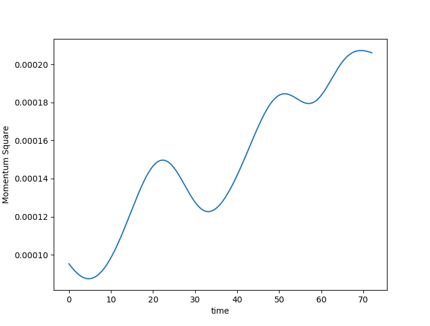
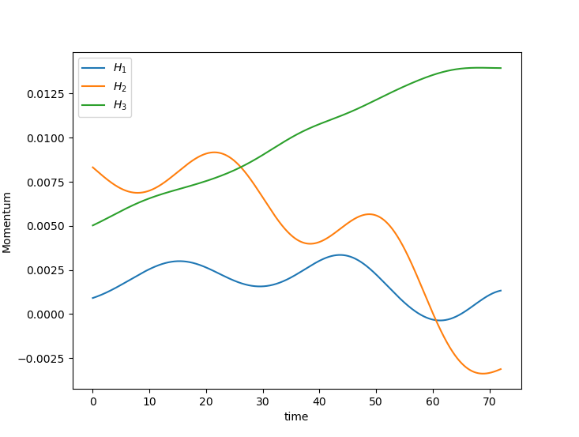
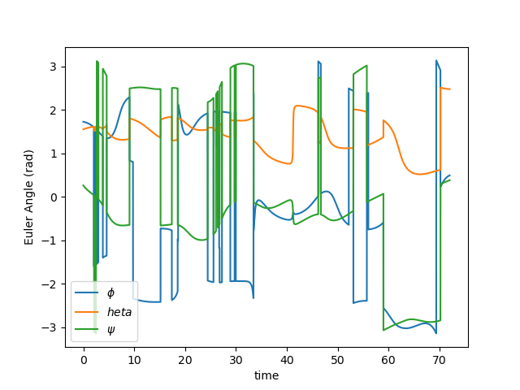
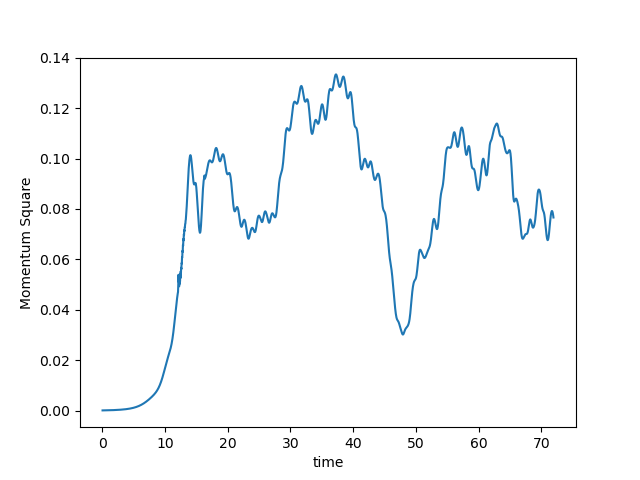
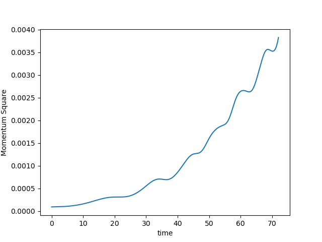
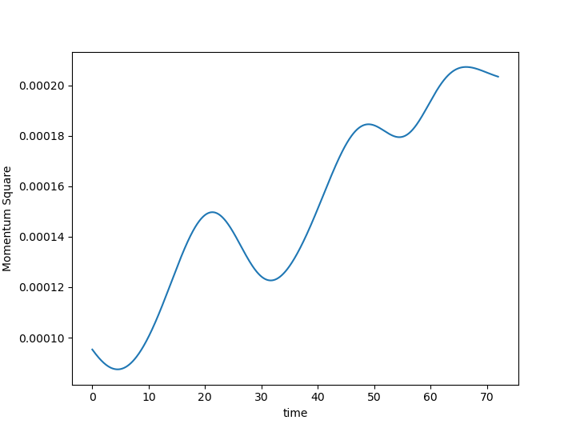
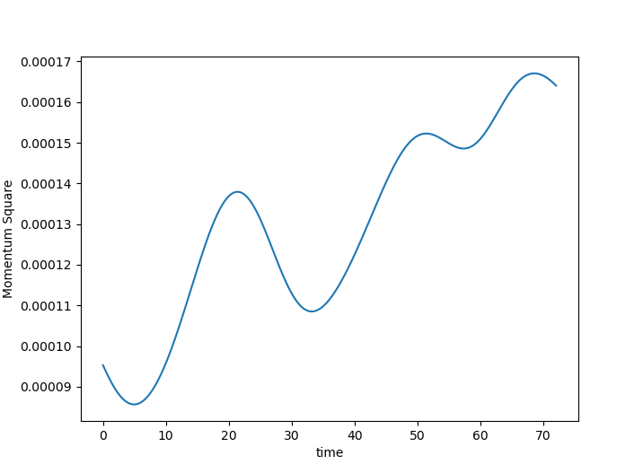
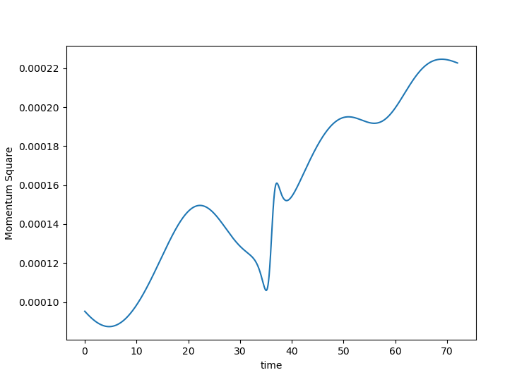
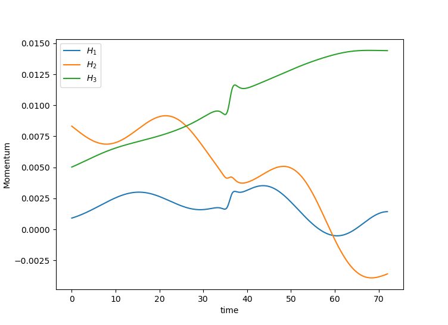
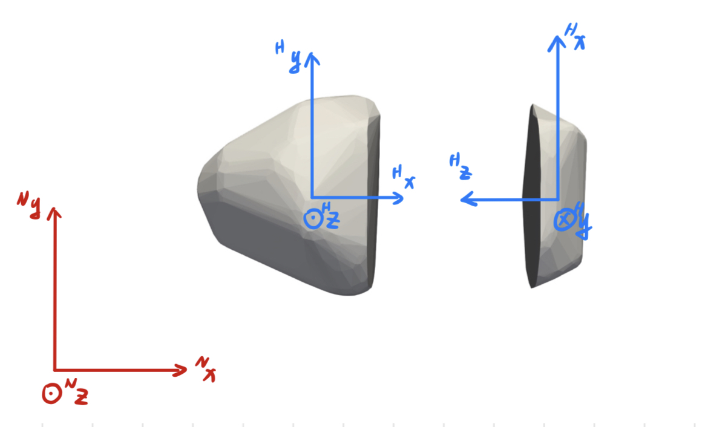

## Report20230720

1. The flyby animation is wrong, I am not sure it provides a correct computation results. But the output figures seem good.
2. By shortening the integration time interval, the global momentum error will decrease.


### Shape Model

In version 4 code (main_gen_sample_v4.py, main_computation_v4.py), I used the two-body configuration (Apophis_N2_v2000.obj) to create a test case. The restitution is zero, and the fraction is $0.5$.

### Torque-free case

<table>
    <tr>
        <td ><center>Fig.1 Angular Momentum Square </center></td>
        <td ><center>Fig.2 Angular Momentum components </center></td>
      <td ><center>Fig.3 Euler Angle </center></td>
    </tr>
</table> 

There are some errors during the simulation. The calculation (for example, mass, coordination, etc) always has only eight effective figures, which come from the underlying C language code, and I can't change that. But I can change the propagation time interval to shrink errors.

<table>
    <tr>
        <td ><center>Fig.4 Time Interval 1E-1 </center></td>
        <td ><center>Fig.5 Time Interval 1E-2 </center></td>
    </tr>
   <tr>
        <td ><center>Fig.7 Time Interval 1E-3 </center></td>
        <td ><center>Fig.8 Time Interval 1E-4 </center></td>
    </tr>
</table> 

Smaller time intervals spend longer time on computation but higher precision. These results show the best time interval is $dt = 1E-3$. Then an animation provides more insight

<video src="Report20230720_pic/notorque_case.avi"> </video><p>Video 1. Torque-free animation</p> 

### Flyby case

I simulated a 3-day flyby case, by inversely integrating position/velocity at C/A to get the initial state. The closest Approach at Apr 13 2029 21:46 (38012 km radius) is
$$
Pos_{C/A} = [-1.918E+04,3.225E+04,6.007E+03] ~km\\
Vel_{C/A} = [6.332E+00,3.405E+00,1.844E+00] ~km/s
$$
and the units are
$$
[L] =  168 ~m,~[M] = 2.650/G ~ kg,~[T] = \sqrt{[L]^3/G[M]}
$$
And non-dimensional time interval is $dt = 1E-3$.

<table>
    <tr>
        <td ><center>Fig.9 Flyby Angular Momentum Square </center></td>
        <td ><center>Fig.10 Flyby Angular Momentum Components </center></td>
    </tr>
</table> 

<video src="Report20230720_pic/flyby_case_frac5.avi"></video><p>Video 2. Flyby animation with 0.5 fraction</p> 

<video src="Report20230720_pic/flyby_case.avi"></video><p>Video 3. Flyby animation with zero fraction</p> 

### Spin Rate

In version 3 code (main_gen_sample_v3.py, main_computation_v3.py), I used the two-body configuration (Apophis_N2_v2000.obj) to create a test case. The density is 10, and the total volume normalizes the polyhedron avatars. And a tricky thing is the initial spin rate setting. 

Three frames should be introduced first: body-fixed ($\mathcal{B}$), body-inertial ($\mathcal{H}$), and inertial frames ($\mathcal{N}$). The body-fixed and body-inertial frames have the same origin, but the body-fixed frame is fixed on the polyhedron body and the axes are aligned with the principal inertia axis. 



Therefore, when we call the function of setting the initial velocity

```python
vel_ome = [vel[0],vel[1],vel[2],omega[0],omega[1],omega[2]]
poly.imposeInitValue(component=[1,2,3,4,5,6], value=vel_ome)
```

the $\omega$ input here means $^\mathcal{B}\omega_{\mathcal{B}/\mathcal{H}}$. If I set $\omega = ^\mathcal{B}\omega_{\mathcal{B}/\mathcal{H}}= [0,0,2\pi]$, we have 

<video src="Report20230716_pic/Seperate_rotation_Bframe.avi"></video><p>Video 4. Fixed position and body-fixed spin rate animation</p> 

We can get the DCM from the moment of inertia. The moment of inertia of polyhedron can be computed $^\mathcal{N}[I]$, from this, the DCM is the stacked Eigenvectors.
$$
[BN]{^\mathcal{N}[I]}[NB] = {^\mathcal{B}[I]}
$$
If I set the $^\mathcal{N}\omega_{\mathcal{B}/\mathcal{H}} = [0,0,2\pi], \omega = [BN]{^\mathcal{N}\omega_{\mathcal{B}/\mathcal{H}}}$, we have 

<video src="Report20230716_pic/Seperate_rotation_Nframe.avi"></video><p>Video 5. Fixed position and inertial spin rate animation</p> 

The initial velocity can be obtained from 
$$
vel_0 ={^\mathcal{N}\omega_{\mathcal{B}/\mathcal{H}}} \times {r_i}
$$
where $r_i$ is the body distance between center of mass and body-$i$. 

<video src="Report20230716_pic/Seperate_rotation_velocity.avi"></video><p>Video 6. Inertial rate animation</p> 

### Total Moment of Inertia

$$
{^\mathcal{N}I_{total}} = {^\mathcal{N}I_i} + V_i
\begin{bmatrix}
d_2^2 + d_3^2 & -d_1d_2 & -d_1d_3 \\
-d_1d_2 & d_1^2 + d_3^2 & -d_2d_3 \\
-d_1d_3 & -d_2d_3 & d_1^2 + d_2^2
\end{bmatrix}
$$

where $d = [d_1, d_2, d_3]$ is the center of mass of i-th body w.r.t total center of mass.
$$
{^\mathcal{N}[I_{total}]} = [NB]{^\mathcal{B}[I_{total}]}[NB]^T
$$

```python
I_diag, P = np.linalg.eigh(inertia_total)
P[:, 2] = np.cross(P[:, 0], P[:, 1])
```

Here
$$
P = [NB]
$$