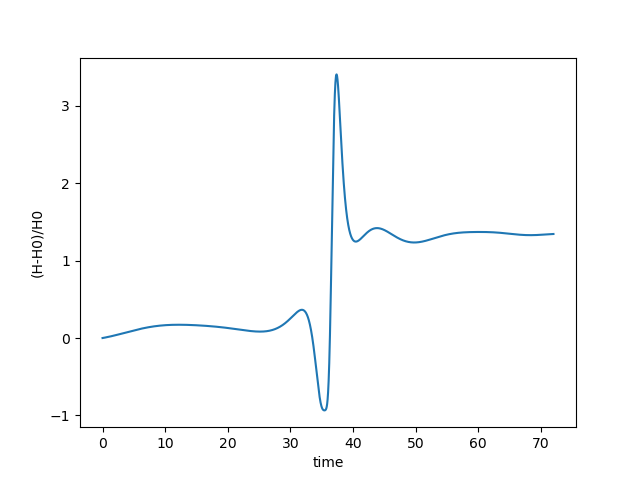

## Questions20230808

1. The Error noise is still too large and covers the signal. The fraction is $frac=0.5$.

<table>
    <tr>
        <td >
Fig.1 
</td>
        <td >
Fig.2 
</td>
    </tr>
</table> 

<video src="Report20230808_pic/reference.avi"></video>

I tried to enlarge the Earth's Torques 10 times by $m_E = 10*m_E$

<table>
    <tr>
        <td >
Fig.3 
</td>
        <td >
Fig.4 
</td>
    </tr>
</table> 

<video src="Report20230808_pic/reference_10times.avi"></video>

2. The same force value inputs get two different results, one force comes from pykdgrav, and the other comes from my own equations. Two schemes provide the same force values, but the performance is totally different. Also, when I set the force equal to zeros, there are still position changes. This is a torques-free case.

<table>
    <tr>
        <td >
Fig.3 
</td>
        <td >
Fig.4 
</td>
    </tr>
</table> 

<video src="Report20230808_pic/scheme_mine.avi"></video>

3. In the small fraction case $frac = 0.01$, the bodies will shake at the initial time.

<table>
    <tr>
        <td >
Fig.1
</td>
        <td >
Fig.2
</td>
    </tr>
   <tr>
</table>

<video src="Report20230808_pic/small_fraction_case.avi"></video>

