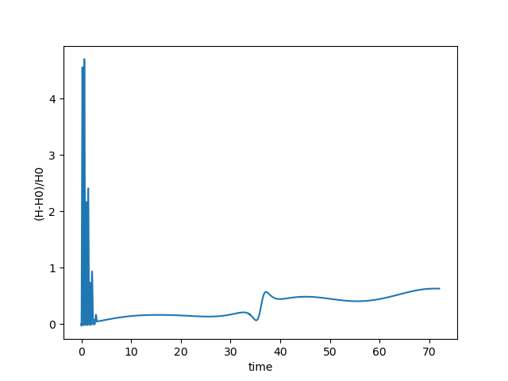

## Questions20230808

1. The Error noise is still too large and covers the signal. The fraction is $frac=0.5$.

<table>
    <tr>
        <td >
Fig.1 
</td>
        <td >
Fig.2 
</td>
      <td >
Fig.3 
</td>
    </tr>
</table> 

<video src="Report20230810_pic/ref_N2.avi"></video>

I tried to enlarge the Earth's Torques 10 times by $m_E = 10*m_E$

<video src="Report20230808_pic/reference_10times.avi"></video>

2. The three bodies and four bodies configurations are tested, and still no significant changes. friction is 0.3.

<table>
    <tr>
        <td >
Fig.3 
</td>
        <td >
Fig.4 
</td>
    </tr>
</table> 

<video src="Report20230810_pic/N3.avi"></video>

<video src="Report20230810_pic/N4.avi"></video>

3. In the small friction case $frac = 0.01$, the bodies will shake at the initial time.

<table>
    <tr>
        <td >
Fig.1
</td>
        <td >
Fig.2
</td>
    </tr>
   <tr>
</table>

<video src="Report20230808_pic/small_fraction_case.avi"></video>

