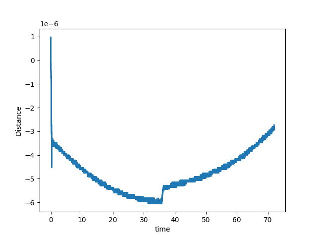
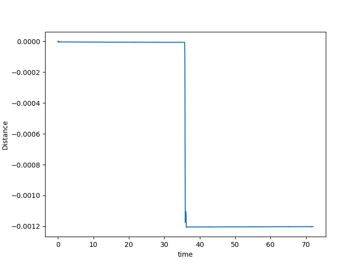
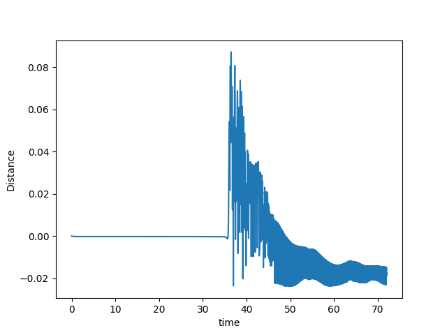
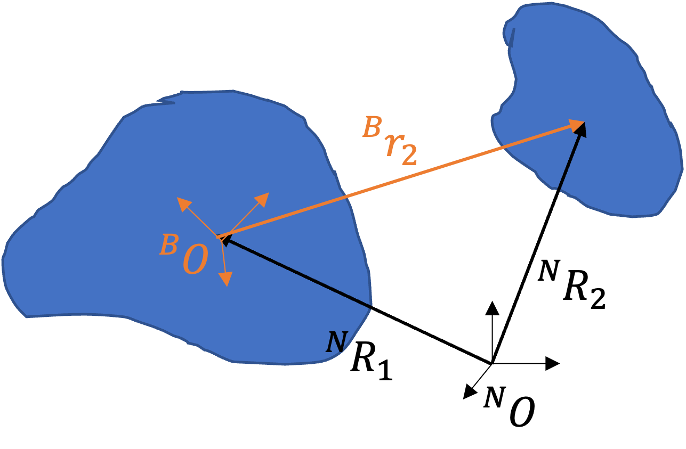
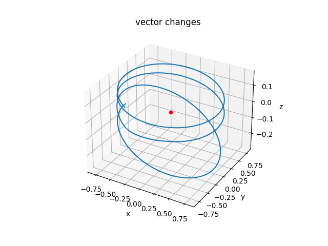
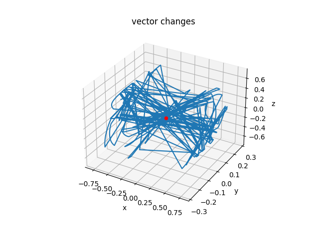

## Report20230912

### Three possible Results

I set the $q = 1.1 R_E$ and $v_\infin = 10 ~km/s$. Varying the friction values $f = 0.5, 0.3, 0.1$, I got three possible results, 1) No relative move, 2) slightly relative move, and 3) breakup. 

<table>
    <tr>
        <td ><center>No Move case </center></td>
        <td ><center>Slightly Move </center></td>
      <td ><center>Breakup </center></td>
    </tr>
</table> 

### Sphericity

Here, I tried to build a general way to describe that the approximation between a polyhedron and its equivalent sphere. And if given a target sphericity $\Psi^*$, the code can generate a new polyhedra having sphericity $\Psi^*$.

Sphericity is defined as 
$$
\Psi = \frac{\sqrt[3]{36V^2\pi}}{S}
$$
in which $V$ is the volume of polyhedra, $S$ is the area of polyhedra.

Given a target sphericity, two changes will happen on the polyhedra, Scaling Vertex and Adding vertex. **But I am not sure why its divergent**

```matlab
Target sphericity: Psi0
polyhedra sphericity: Psi
equivalent sphere radius: r0
When sphericity does not equal target value: abs(Psi - Psi0) > ToF
MaxLoop = 100
for i=1:MaxLoop
	Check all vertex is they are on the equivalent sphere surface: abs(norm(vertex)-r0)
	If not: abs(norm(vertex)-r0) > ToF
			Scaling Vertex:
			r = norm(vertex)
			delta_r = (r - r0)(Psi - Psi0)/Psi0*sign(Psi-Psi0)*sign(Psi0-1)
			scale = (r0 + delta_r)/r
			new_vertex = vertex*scale
  elif yes: abs(norm(vertex)-r0) < ToF
  		Adding new vertex:
  		Choose the face having the farest distance with equivalent sphere
  		New vertex is at the center of the face
  		delete the original faces connectivity
  		create three new faces
  end
  
  if abs(Psi - Psi0) < ToF
  		break
  end
end
```

### DCM Problem

I am trying to find some way to track the second body's movement at the primary body-fixed frame. The shape mode is two polyhedra moving based on gravity in space. But I can't find a correct way to define the body-fixed frame on one body. (I suppose the large one is primary, smaller one is secondary)

<table>
    <tr>
        <td ><center>Shape model </center></td>
        <td ><center>Frames introduction </center></td>
    </tr>
</table> 

Two ways I tried, One uses the position of primary as the origin, then choose a vertex position $\vec{x} = \vec{v}_1$ relative to the origin as the x-axis. Then choose another vertex position relative to origin $\vec{v}_2$ to get the z-axis $\vec{z} = \vec{v}_1 \times \vec{v}_2$, finally we can get y-axis from $\vec{y} = \vec{z}\times \vec{x}$. 

**But, the problem is that I can not get the vertex information from 'chipy' library in computation.py. Are there some functions that can return the all body's vertex during computation?**


The other one is that I tried to use the Direction Cosine Matrix ('et la matrice de passage') provided in Line 452 of avatar.py to rotate the position vector from the inertial frame to the body-fixed frame. The stacking of eigenvalues of global inertia ('P' variable in code) should be the Direction Cosine Matrix, which can rotate the vector from the inertial frame to the body frame.
$$
^{\mathcal{B}}\vec{r}_2 = {^{\mathcal{N}}\vec{R}_2} - {^{\mathcal{N}}\vec{R}_1} = P ({^{\mathcal{N}}\vec{R_2}}-{^{\mathcal{N}}\vec{R}_1})
$$
Where $^{\mathcal{B}}\vec{r}_2$ is the secondary's position at the primary's body-fixed frame, ${^{\mathcal{N}}\vec{R}_{1/2}}$ is the primary/secondary position at the inertial frame. The body-fixed frame is fixed on the primary with the same rotation.

 **But, The rotation matrix would be wrong. In this animation, the secondary should be stationary relative to the primary, but when I use the above equation to get the position relative to the primary, it jumps around the primary.**

<video src="Report20230911_pic/stationary.avi"></video>

<table>
    <tr>
        <td ><center>Secondary's orbit at inertial frame </center></td>
        <td ><center>Secondary's orbit at Primary's body-fixed frame </center></td>
    </tr>
</table> 