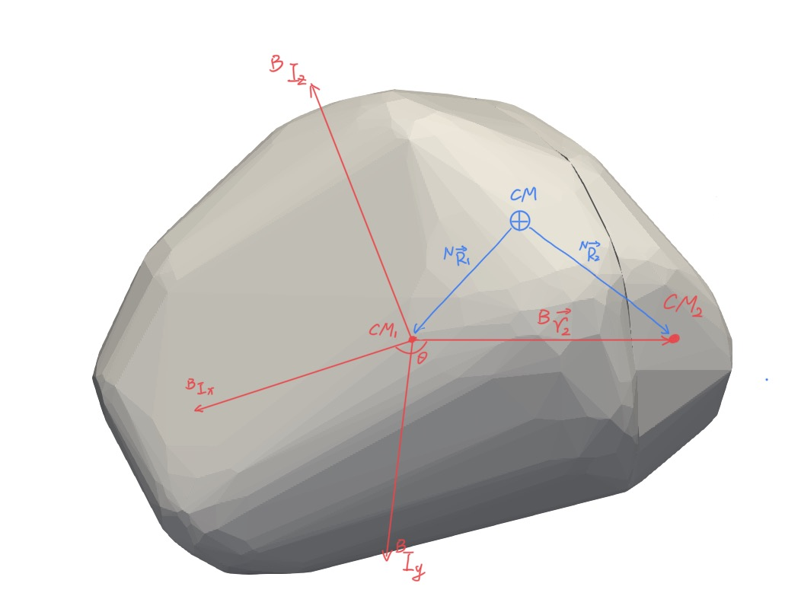
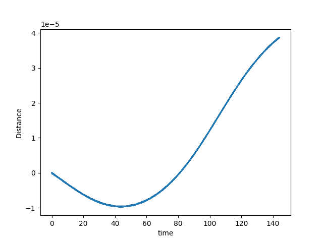
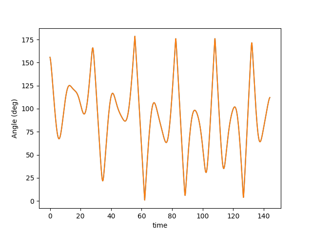
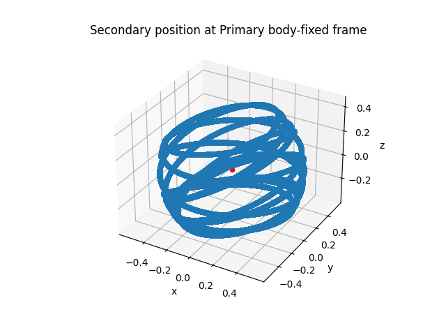

## Report20230914


### DCM ('et la matrice de passage') Matrix Problem

Following the third question, more details are provided to specify my problem. In this case, the animation shows that the secondary body should be stationary relative to the primary body. However the relative position of the secondary at the primary body-fixed frame changes with time.

All functions I used in the code are here, I checked I_diag, I_global, and coor, all these are correct, so I think the problem may be the P variable.

```python
I_global = chipy.RBDY3_GetGlobInertia(1)
I_diag, P = np.linalg.eigh(I_global)
P[:, 2] = np.cross(P[:, 0], P[:, 1])
r2 = np.dot(P.T,coor[1,0:3] - coor[0,0:3])
dis = np.linalg.norm(coor[1,0:3] - coor[0,0:3])
```

More detailed explanations follow. 

#### Configuration

I created two polyhedra boulders, they rest on each other held by gravity with ($rstn = 1, rstt = 0, fric = 0.5$) and rotation together. The animation is attached to the email. 




I want to use the DCM ('et la matrice de passage') matrix to detect if there is some shifting between these two bodies. 

What I did here is I tried to construct a body-fixed frame on one body, I call it the **primary** (larger one). 

Given the global moment of inertia, I hope I can use the principal axis of body inertia to construct the body-fixed frame. In this figure, ${^\mathcal{B}I_x}, {^\mathcal{B}I_y}, {^\mathcal{B}I_z}$ means the three principal axes of body inertia. The three principal axes of body inertia for the rigid body should be fixed on the body only depending on its mass distribution and rotate with the body together. 

In this body-fixed frame, the position of the other body (**secondary** here) is denoted as ${^\mathcal{B}\vec{r}_2}$. If there is no relative shifting or moving, the direction and magnitude of ${^\mathcal{B}\vec{r}_2}$ should be constant. And the relative angle $\theta$ between this position ${^\mathcal{B}\vec{r}_2}$ and ${^\mathcal{B}I_x}$ axis should be also constant.

Also $CM_1, CM_2, CM$ indicate the center of mass of Primary, Secondary, and total bodies. The inertial frame is constructed on the center of the total mass $CM$.  The positions of primary and secondary are present as ${^\mathcal{N}\vec{R}_1}, {^\mathcal{N}\vec{R}_2}$, these two vectors change with time.

From here, we can get the equation to compute the ${^\mathcal{B}\vec{r}_2}$ by using the DCM ('et la matrice de passage') denoted as $P$,
$$
{^\mathcal{B}\vec{r}_2} = P ({^{\mathcal{N}}\vec{R_2}}-{^{\mathcal{N}}\vec{R}_1})
$$

 #### Match this notation to the code

Get the global moment of inertia,

```python
I_global = chipy.RBDY3_GetGlobInertia(1)
```

Compute the body moment of inertia and DCM ('et la matrice de passage')

```python
I_diag, P = np.linalg.eigh(I_global)
P[:, 2] = np.cross(P[:, 0], P[:, 1])
Ix = P[:,0]
```

Compute the position of the secondary at the body-fixed frame, and the relative angle between this position and ${^\mathcal{B}I_x}$ axis.

```python
r2 = np.dot(P.T,coor[1,0:3] - coor[0,0:3])
theta = math.acos(np.dot(Ix,r2)/np.linalg.norm(Ix)/np.linalg.norm(r2))
```

Also, the relative distance is computed to verify if the secondary moving,

```python
dis = np.linalg.norm(coor[1,0:3] - coor[0,0:3])
```

#### Results

The relative distance shows there is no shifting between two bodies.



But the relative angle and relative position show the secondary moving.

<table>
    <tr>
        <td ><center>relative angle </center></td>
        <td ><center>relative position </center></td>
    </tr>
</table> 
