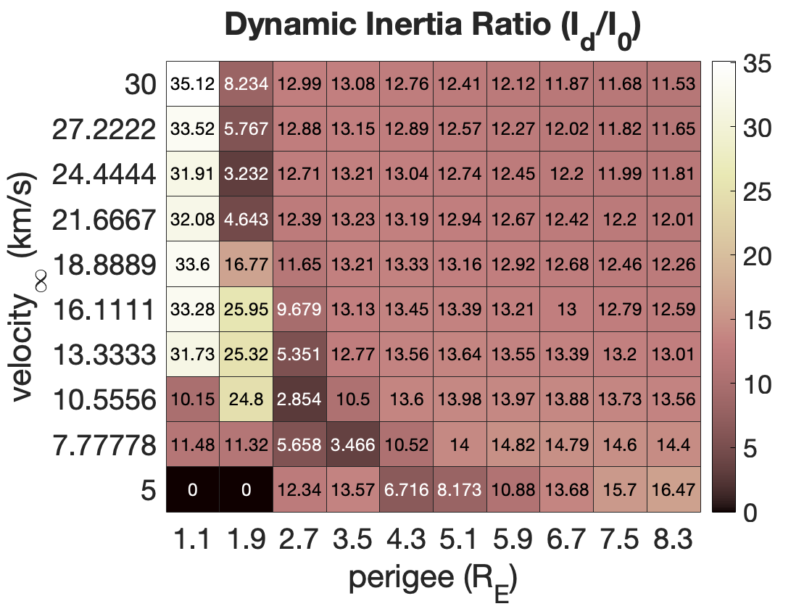
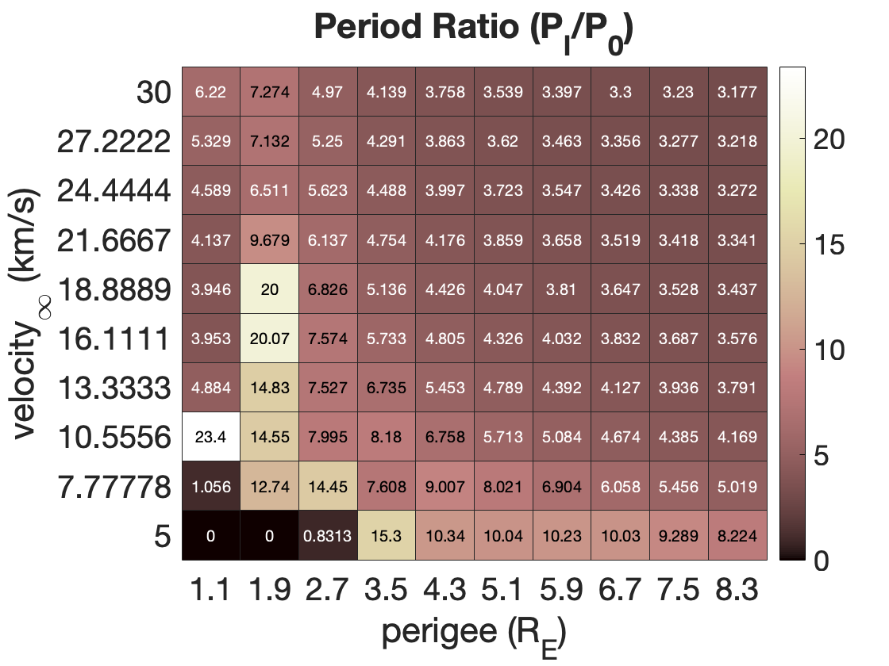
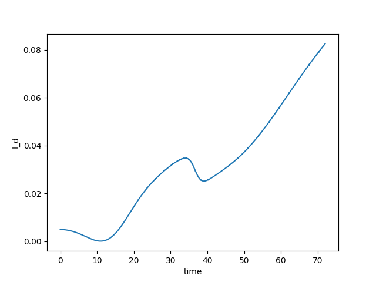
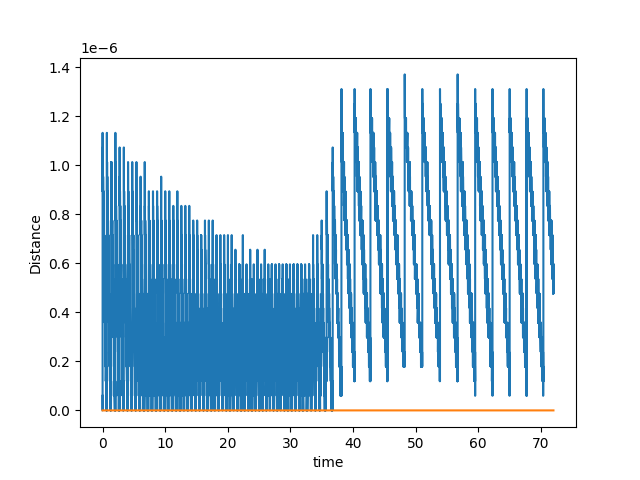
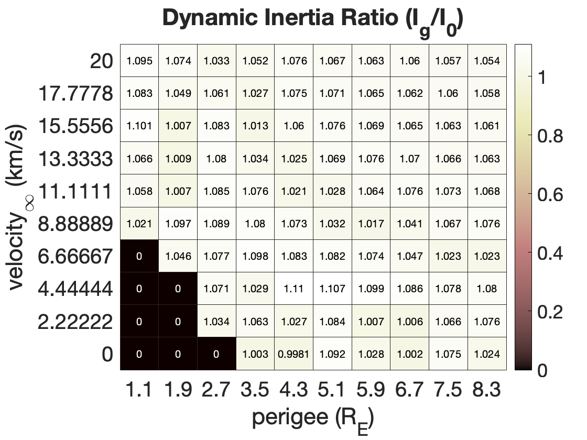
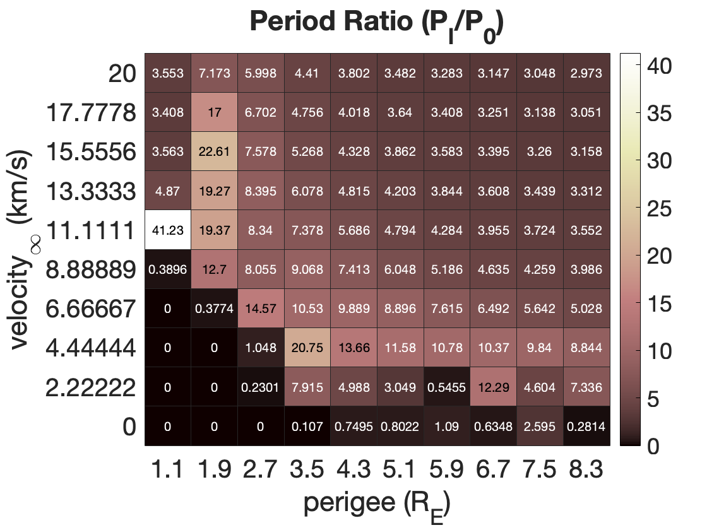
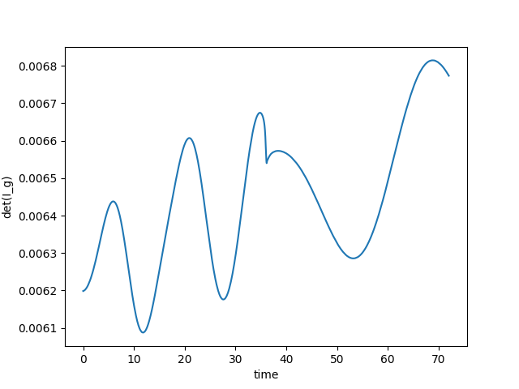
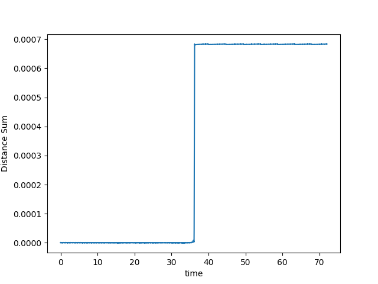

## Report20230925

### Summary:

- Dynamic Inertia is not a good index to monitor the mass shifting, because it includes the changes of rotation. The dynamics inertia $I_d = H^2/2K$ do not pull the rotation component out.
-  The determinant of global moment of inertia $I_g = \sum(I_i + m_i[\tilde{r}_i][\tilde{r}_i]^T)$ is a correct way to monitor mass shifting, but the S/N is terrible. Some minor changes are usually immersed by error. 
- Then the sum of shifting distance would be the better way to monitor mass shifting. The only calculation involved is the addition, the S/N is much better than the determinant of the global moment of inertia $I_g$.

### 1. Dynamic Inertia

<table>
    <tr>
        <td >
Dynamic Inertia 
</td>
        <td >
Period Ratio 
</td>
    </tr>
</table> 

Then I sampled several blocks to check the real mass shifting, then, I found the dynamic inertia is not good enough to monitor the mass shifting. For example, the right-bottom block ($q = 8.3R_E, v_\infin = 5~km/s$) shows a big shifting relative to other conditions, but the real is not.

<table>
    <tr>
        <td >
Dynamic Inertia change for example case 
</td>
        <td >
relative distance change for example case 
</td>
    </tr>
</table> 

Also, the animation doesn't show any obvious shift 

<video src="Report20230925_pic/Id.avi"></video>

### 2. The determinant of global moment of inertia

The global moment of inertia depends on the body-fixed inertia, its mass, and its relative position w.r.t CM. The body-fixed inertia and its mass are constants, is the relative positions changes, I expect to observe some changes in the global moment of inertia.
$$
det(I_g) = det[\sum(I_i + m_i[\tilde{r}_i][\tilde{r}_i]^T)]
$$

<table>
    <tr>
        <td >
Global Inertia determinant 
</td>
        <td >
Period Ratio 
</td>
    </tr>
</table> 

Same, I pick an example ($q = 1.1R_E, v_\infin = 11.111 ~km/s$) shows little mass shift, but actually, the shift is totally observable by monitoring relative distance. Here, I think the computation error about $0.0007$, but the change in global inertia is $0.0001$. 

<table>
    <tr>
        <td >
Global Inertia change for example case 
</td>
        <td >
relative distance change for example case 
</td>
    </tr>
</table> 

